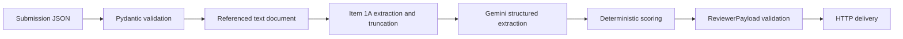

# ORION AI Pipeline

An AI-assisted pipeline for reviewing authorization submissions for high-risk financial and digital infrastructure services.

The pipeline validates a submission, extracts the relevant risk section from a referenced document, asks Gemini for structured risk assessments, applies deterministic scoring rules, builds a reviewer payload, and sends that payload to a downstream HTTP endpoint.

The system is designed for supervised automation: the model produces structured evidence and risk signals, while the final recommendation is calculated by ordinary application code and remains subject to human review.

## Current Status

The repository is a working local example, not a production authorization service.

Validated locally:

- The package installs in editable mode.
- All package modules import successfully.
- The parser processes the bundled Coinbase filing.
- The submission JSON passes Pydantic validation.
- The automated test suite passes.
- The Docker image builds successfully when Docker Desktop is running.

The live end-to-end command requires a valid `GEMINI_API_KEY`. With a valid key and network access, the current sample run reaches Gemini, scores the result, and delivers it to the configured HTTP endpoint.

## Architecture



The executable entrypoint is:

```text
python -m orion
```

The workflow is intentionally linear. `OrionPipeline` coordinates the stages but does not contain the scoring policy or model implementation itself.

## Processing Flow

1. `orion.__main__` creates an `OrionPipeline` and processes the bundled submission file.
2. `OrionPipeline` loads `data/mock_input/submission_coinbase.json`.
3. `SubmissionInput` validates the submission metadata and document references.
4. Each document URI is resolved. `local://` paths are mapped directly, while `s3://` and `gs://` paths are routed to a local `data/raw/` mirror for this assessment.
5. `DocumentParser` reads each normalized text file.
6. The parser finds the longest section between `Item 1A. Risk Factors` and `Item 1B. Unresolved Staff Comments`.
7. Each extracted section is limited to 500,000 characters, and aggregate context is capped at 800,000 characters across documents.
8. `LLMEngine` sends the text to Gemini using a structured Pydantic response schema.
9. Gemini returns `DimensionRisk` records for four dimensions.
10. `RiskScorer` calculates a weighted composite score and authorization recommendation.
11. `ReviewerPayload` validates the assembled result.
12. `ReviewAPIClient` sends the payload as an HTTP POST request.
13. The final payload is printed if all external calls succeed.

## Package Responsibilities

### `src/orion/pipeline.py`

`OrionPipeline` is the workflow orchestrator. It creates the parser, LLM engine, scorer, and review API client, then executes them in order through `process_submission()`.

### `src/orion/schemas.py`

Defines the Pydantic contracts:

- `ApplicantMetadata`: applicant name, jurisdiction, executives, activities, and employee count.
- `SubmissionInput`: submission ID, applicant metadata, and document URI list.
- `DimensionRisk`: a dimension name, risk level, rationale, supporting evidence, and mitigating controls.
- `ReviewerPayload`: timestamped output containing risk dimensions, score, recommendation, and follow-up questions.

### `src/orion/parser.py`

`DocumentParser` handles the current SEC 10-K text format. It searches case-insensitively for an Item 1A to Item 1B range, chooses the longest match to avoid a table-of-contents match, and truncates each result to 500,000 characters. If the expected section markers are not found, it raises `SectionNotFoundError`; the pipeline logs the problem and continues with other referenced documents.

### `src/orion/llm.py`

`LLMEngine` uses the `google-genai` SDK and the `GEMINI_API_KEY` environment variable. The default model is `gemini-3.6-flash`.

The model is instructed to assess:

- Operational Resilience
- Regulatory Integrity
- Financial Solvency
- Data Security

The response is requested as JSON matching the `RiskExtraction` Pydantic model, which contains a list of `DimensionRisk` objects.

### `src/orion/scoring.py`

`RiskScorer` is deterministic and independent of the LLM response format beyond the validated risk records.

Risk levels map to numeric values:

| Risk level | Numeric value |
| --- | ---: |
| Low | 1.0 |
| Medium | 2.5 |
| High | 5.0 |

Dimension weights are:

| Dimension | Weight |
| --- | ---: |
| Operational Resilience | 0.20 |
| Regulatory Integrity | 0.35 |
| Financial Solvency | 0.15 |
| Data Security | 0.30 |

Authorization thresholds are:

- Score `<= 1.8`: `Full Authorization`
- Score `> 1.8` and `<= 3.2`: `Conditional Authorization`
- Score `> 3.2`: `Requires Supervisory Audit`

A `High` result in `Regulatory Integrity` or `Data Security` overrides the composite score and returns `Requires Supervisory Audit`.

High-risk dimensions also produce targeted follow-up questions. If no high-risk dimension exists, the scorer returns a standard periodic-reporting message.

### `src/orion/api_client.py`

`ReviewAPIClient` first requests a temporary capture endpoint from `https://webhook.site/token`. When successful, it sends the validated `ReviewerPayload` to that unique webhook URL and logs a viewer URL for human inspection. If webhook.site cannot be reached, it falls back to `https://httpbin.org/post`.

The client adds JSON, authorization, submission, timestamp, origin, and risk-tier headers. The dynamically created webhook is intended for demonstration and inspection, not production data.

The optional `REVIEW_API_KEY` environment variable controls the bearer token. If it is not set, the current implementation uses `mock-api-key`.

A successful response is considered HTTP `200` or `201`. Timeouts, connection errors, and other request errors are logged and return `False`.

### `src/orion/__main__.py`

Provides the normal module entrypoint:

```powershell
python -m orion
```

It uses the bundled Coinbase submission path and prints the resulting reviewer payload after the pipeline completes.

## Scope Boundaries and Phase 2

The assignment is time-boxed, so the implementation deliberately focuses on the pipeline contract and orchestration rather than every production integration. The following are explicit design boundaries, not accidental omissions.

### Document formats

Phase 1 assumes that PDF, DOCX, and XLSX files have already been normalized into text upstream. The current parser therefore operates on normalized text and is specialized for SEC 10-K Item 1A/1B markers. Adding robust PDF, DOCX, and spreadsheet extraction would require format-specific parsers, heavier dependencies, and a larger fixture corpus.

Phase 2 can introduce multimodal document handling and OCR, including tools such as `pdfplumber`, `openpyxl`, and OCR services where appropriate. The storage and parsing boundaries in the current pipeline are intended to make that extension possible without changing scoring or delivery contracts.

### Reviewer overrides

The ML pipeline intentionally emits the initial recommendation only. Fields such as analyst override status, analyst comments, final review state, and override timestamps belong to the downstream review database and UI, where a human actually interacts with the result. `ReviewerPayload` remains bounded to the machine-generated assessment and does not pretend to own downstream workflow state.

### Audit hashes and test breadth

The current implementation provides stage-level logging, validated contracts, deterministic scoring, and reproducible rules. Persistent input/output hashes, prompt and policy version records, and broader integration fixtures are enterprise hardening steps planned for a later phase. The current tests focus on the deterministic core and parser behavior rather than claiming 100% coverage.

### Follow-up question logic

The current follow-up generator provides deterministic questions for high-risk dimensions. A complete contradiction-detection tree across multiple heterogeneous documents would be a separate analysis product, so contradiction discovery remains a Phase 2 extension rather than an implicit promise of this implementation.

## Repository Structure

```text
.
├── data/
│   ├── mock_input/
│   │   └── submission_coinbase.json  # Bundled submission metadata
│   └── raw/
│       ├── coinbase_10k.txt          # Raw SEC filing text
│       └── extracted_item_1a.txt     # Parser-generated/manual extraction sample
├── scripts/
│   └── fetch_coinbase_10k.py         # Downloads and cleans the SEC filing
├── src/
│   └── orion/
│       ├── __init__.py
│       ├── __main__.py               # python -m orion entrypoint
│       ├── api_client.py             # Downstream HTTP adapter
│       ├── llm.py                    # Gemini adapter
│       ├── parser.py                 # Item 1A document extraction
│       ├── pipeline.py               # Workflow orchestration
│       ├── schemas.py                # Pydantic contracts
│       └── scoring.py                # Deterministic scoring
├── tests/
│   └── test_pipeline.py              # Parser and scoring tests
├── .env                              # Local secrets, not committed
├── .gitignore
├── docker-compose.yml
├── Dockerfile
├── pyproject.toml
├── pytest.ini
├── README.md
└── requirements.txt
```

## Requirements

- Python 3.11 or newer
- A valid Gemini API key for the live pipeline command
- Docker Desktop, if using the container workflow

The project uses a `src` layout and the installable package name is `orion-ai-pipeline`. The import package name is `orion`.

## Configuration

Create a local `.env` file in the repository root or set environment variables in the shell.

Required for the LLM stage:

```env
GEMINI_API_KEY=your-valid-gemini-api-key
```

Optional for the review API request:

```env
REVIEW_API_KEY=your-review-api-key
```

`src/orion/llm.py` calls `load_dotenv()` when it is imported, so values in `.env` are available to the LLM engine.

Do not commit `.env` or expose API keys in source code, logs, Docker images, or documentation.

## Installation

Create and activate a virtual environment.

Windows PowerShell:

```powershell
python -m venv .venv
.\.venv\Scripts\Activate.ps1
```

macOS/Linux:

```bash
python -m venv .venv
source .venv/bin/activate
```

Install the package and development dependencies:

```bash
python -m pip install --upgrade pip
python -m pip install -e ".[dev]"
```

`pyproject.toml` is the canonical dependency definition. The `dev` extra currently adds pytest. `requirements.txt` delegates to the same editable installation with:

```text
-e .[dev]
```

## Running Locally

From the repository root, with a valid Gemini key configured:

```powershell
python -m orion
```

The command processes:

```text
data/mock_input/submission_coinbase.json
```

That submission references an object-storage-style URI:

```text
s3://orion-enterprise-audits/coinbase_10k.txt
```

For this local assessment, the pipeline routes that URI to the mirror file `data/raw/coinbase_10k.txt`. The command contacts both Gemini and the configured review endpoint. It is not a credential-free offline demo.

## Running Tests

```powershell
python -m pytest -q
```

The current test suite covers:

- Weighted high-risk scoring and critical-domain escalation.
- Weighted low-risk scoring and full authorization.
- Item 1A parser extraction while excluding the table of contents.

Tests import the installed `orion` package. `pytest.ini` configures test discovery with `testpaths = tests`; it does not add `src` to `PYTHONPATH`.

## Docker

Build the image:

```powershell
docker build -t orion-ai-pipeline .
```

Run it directly, supplying the key without putting it in the image:

```powershell
docker run --rm `
  -e GEMINI_API_KEY=$env:GEMINI_API_KEY `
  -e REVIEW_API_KEY=$env:REVIEW_API_KEY `
  -v "${PWD}\data:/app/data" `
  orion-ai-pipeline
```

Or use Docker Compose:

```powershell
docker compose up --build
```

The Compose service:

- Builds from `Dockerfile`.
- Installs the project with `pip install --no-cache-dir .`.
- Runs `python -m orion`.
- Passes through `GEMINI_API_KEY` from the host environment or Compose environment.
- The current Compose file does not pass `REVIEW_API_KEY`; without a Compose override, the client uses its built-in `mock-api-key` default.
- Mounts the local `data/` directory at `/app/data`.

The Docker image does not rely on `PYTHONPATH=/app/src`.

## Refreshing the Sample Filing

`scripts/fetch_coinbase_10k.py` downloads the configured Coinbase filing from SEC EDGAR, removes HTML markup, normalizes whitespace, and writes:

```text
data/raw/coinbase_10k.txt
```

Run it from the repository root:

```powershell
python scripts/fetch_coinbase_10k.py
```

The script contains a personal SEC User-Agent string and should be updated with the operator's own contact information before reuse. It performs a live network request and may be subject to SEC access policies.

## Output Shape

A successful run produces a payload shaped like this:

```json
{
  "submission_id": "SUB-COINBASE-2026",
  "submission_timestamp": "2026-09-16T12:00:00+00:00",
  "dimension_risks": [
    {
      "dimension_name": "Data Security",
      "risk_level": "High",
      "rationale": "The filing describes a material security incident.",
      "evidence": "Evidence quoted from the supplied filing",
      "mitigating_controls": "Controls disclosed in the filing"
    }
  ],
  "composite_score": 3.8,
  "recommended_authorization_level": "Requires Supervisory Audit",
  "follow_up_questions": [
    "Submit independent penetration testing reports and evidence of account recovery hardening implemented after the cited incident."
  ]
}
```

The timestamp is generated at runtime. The exact risk records, score, recommendation, and questions depend on the model response and deterministic scoring rules.

## Validation Results

The current implementation has been checked with:

```powershell
python -m pytest -q
python -m compileall -q src tests scripts
python -m pip check
```

The bundled parser and input contract were also exercised successfully, and the Docker image built successfully when Docker Desktop was running.

The full live command requires a valid Gemini API key. With an invalid key, the pipeline stops at the Gemini request with `API_KEY_INVALID` before scoring and HTTP delivery. With a valid key, the current implementation has been exercised through Gemini scoring and HTTP delivery.

## Known Limitations

- The live LLM provider is fixed to the Google Gemini SDK and the default model name is `gemini-3.6-flash`.
- The parser currently reads upstream-normalized text files and is specialized for SEC 10-K Item 1A/1B markers. It does not parse PDF, DOCX, or XLSX files directly in Phase 1.
- All document URIs are attempted, but `s3://` and `gs://` references use a local filename mirror rather than real object-storage clients.
- `local://` URI resolution is a simple prefix removal, not a production storage abstraction.
- Each document is capped at 500,000 extracted characters and aggregate context is capped at 800,000 characters to respect fixed execution and model-context budgets.
- Review delivery dynamically uses webhook.site when available and falls back to httpbin; neither endpoint is a real authorization system.
- HTTP delivery has status handling but no retry or backoff policy.
- Risk levels and dimensions are plain strings rather than constrained enums.
- The application logs progress but does not currently persist audit records, cryptographic hashes, run IDs, or model metadata; these are planned audit hardening steps.
- The current command performs live external calls and has no offline mock mode.
- Authorization results are recommendations for human review, not autonomous decisions.
- The sample data is for development and evaluation only.

## Next Steps

The highest-value Phase 2 extensions are:

1. Add multimodal PDF/DOCX/XLSX extraction and OCR after upstream normalization requirements are clarified.
2. Replace local object-storage mirroring with S3/GCS adapters and explicit dependency injection.
3. Persist audit records with input/output hashes, model metadata, prompt version, scoring-policy version, and delivery metadata.
4. Add integration tests for multi-document aggregation, parser failures, fallback models, delivery failures, and malformed model responses.
5. Add contradiction and inconsistency analysis across document evidence.

## Security Notes

- Keep `.env` out of version control.
- Use a secret manager for container or production deployments.
- Review the downstream endpoint and bearer-token behavior before sending real submissions.
- Avoid logging document contents or API credentials.
- Do not use the sample recommendation as a production authorization decision.
