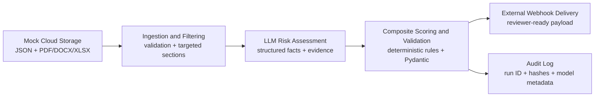
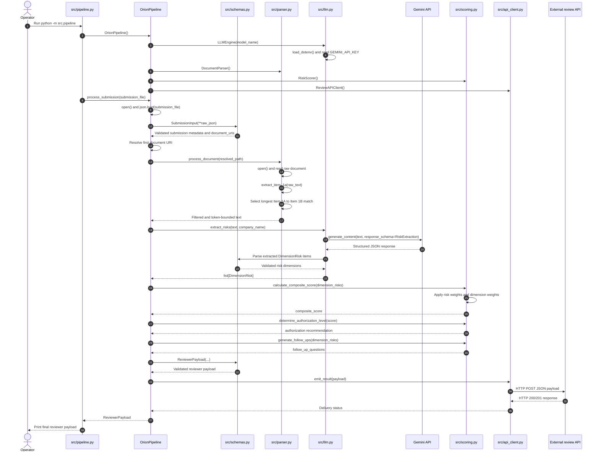

# ORION Pipeline

[](../../actions)
[](https://www.python.org/)

An auditable, serverless-oriented AI pipeline for assessing authorization submissions for ORION, the Operational Risk & Integrity Office.

## Executive Summary

ORION reviews firms seeking authorization to provide high-risk financial and digital infrastructure services. Each submission combines structured applicant metadata with a potentially large and noisy document set. This project turns those inputs into a validated reviewer payload containing dimension-level risk ratings, deterministic composite scores, a recommended authorization level, evidence references, and targeted clarification questions.

The design follows **Supervised Automation**. AI is used to extract and interpret relevant evidence; it does not make the final authorization decision. Deterministic scoring, strict data contracts, traceable evidence, and human override fields keep the result reviewable by an analyst and reproducible after the workflow completes.

Because the assessment does not provide production data or live integrations, the repository includes synthetic input data, a mock PDF audit, and mocked object-storage and review-API clients. These components demonstrate the complete ingestion-to-delivery path without requiring credentials or external services.

## System Architecture



## Pipeline Sequence

The sequence below maps the executable call path from `python -m src.pipeline` to the final review API request. The `schemas.py` participant represents Pydantic validation rather than an active service or network call.



### Control Flow and Component Responsibilities

The pipeline follows a linear orchestration pattern. Each component has one primary responsibility and communicates through explicit Python values rather than sharing mutable state:

1. **Application entrypoint (`src/pipeline.py`)**: Creates the pipeline dependencies and starts `process_submission()` with the submission JSON path. This module owns workflow order, not risk policy.
2. **Input contract (`src/schemas.py`)**: `SubmissionInput` validates the applicant metadata and document references at the boundary. Invalid input stops processing before documents or the LLM are called.
3. **Document filtering (`src/parser.py`)**: `DocumentParser.process_document()` reads the referenced text file and delegates to `extract_item_1a()`. The parser selects the relevant `Item 1A` section and limits its size before model invocation.
4. **AI extraction (`src/llm.py`)**: `LLMEngine.extract_risks()` sends only the filtered text to Gemini. The `RiskExtraction` response schema constrains the response, and each result is represented as a `DimensionRisk` containing a rating and evidence.
5. **Decision synthesis (`src/scoring.py`)**: `RiskScorer` converts qualitative ratings into weighted numeric values, calculates the composite score, maps it to an authorization recommendation, and generates targeted follow-up questions. These operations are deterministic and independent of the LLM.
6. **Output contract (`src/schemas.py`)**: `ReviewerPayload` validates the assembled result before it leaves the application. This is the final protection against malformed downstream data.
7. **Delivery adapter (`src/api_client.py`)**: `ReviewAPIClient.emit_result()` serializes the validated payload and sends it to the configured review endpoint. HTTP delivery is isolated behind an adapter so it can be replaced by a cloud API client or test double.

### Engineering Principles Applied

- **Separation of concerns**: orchestration, parsing, model access, scoring, validation, and delivery are kept in separate modules.
- **Dependency direction**: `pipeline.py` coordinates collaborators; domain decisions remain in `scoring.py` and data contracts remain in `schemas.py`.
- **Fail-fast validation**: input and output are validated at system boundaries, before expensive model calls or external delivery.
- **Deterministic core**: the LLM proposes evidence-based risk dimensions, but scoring and authorization thresholds are calculated by ordinary application code.
- **Replaceable adapters**: the LLM provider, document source, and review API can be replaced without rewriting the orchestration flow.
- **Traceable execution**: each stage logs its progress and failures, making the run easier to inspect and replay.
- **Human-in-the-loop control**: the authorization level is a recommendation for analyst review, not an autonomous approval decision.

### Processing stages

1. **Ingest**: Fetch the primary JSON and referenced documents from object storage. Validate the submission contract before processing.
2. **Filter**: Extract only sections relevant to the risk dimensions. This bounds tokens, latency, and memory when document sets exceed 100 pages.
3. **Assess**: Ask the configured LLM provider to return structured facts, risk signals, confidence, and source references. The provider can be replaced with a deterministic mock for local execution.
4. **Score and validate**: Apply versioned deterministic scoring rules, calculate composite scores, derive an authorization recommendation, and validate the complete payload.
5. **Deliver**: POST the validated payload to the external review API. Persist structured logs and input/output hashes for audit and replay.

## Design Decisions and Trade-offs

### Token efficiency for serverless execution

The workflow does not send an entire document set to the LLM. A targeted extraction stage selects relevant headings, pages, tables, and nearby context for each risk dimension. This reduces token cost and helps keep execution within fixed serverless limits. The trade-off is that extraction rules must be tested against document variations; unclassified or low-confidence material is retained as a review signal rather than silently discarded.

### Deterministic scoring

The LLM produces evidence and interpretable signals, while composite scores and authorization thresholds are calculated in application code. Versioned weights and thresholds make the recommendation stable across repeated runs and allow analysts to explain how it was derived. A human reviewer can override the recommendation without mutating the original machine-generated assessment.

### Auditability and reproducibility

Each run receives a correlation ID and records structured events for ingestion, filtering, model invocation, scoring, validation, and delivery. The audit record includes input hashes, selected document references, prompt/model configuration, scoring-policy version, validation results, and output hashes. Secrets and unnecessary document contents are excluded from logs. This supports investigation and replay while respecting data-minimization requirements.

### Strict contracts at boundaries

Pydantic models define both the incoming submission and outgoing reviewer payload. Boundary validation catches malformed metadata, unsupported risk values, missing evidence fields, and incompatible schema changes before delivery to the review API.

### Mock-first integration

The mock storage and webhook clients preserve the same interfaces as their production adapters. Local execution therefore exercises orchestration, validation, scoring, logging, and delivery without coupling the core pipeline to a cloud vendor or an LLM API key.

## Repository Structure

```text
.
├── data/
│   ├── submission.json          # Synthetic applicant metadata
│   └── audit_mock.pdf           # Synthetic supporting document
├── src/
│   └── orion/
│       ├── __init__.py
│       ├── config.py            # Environment-backed settings
│       ├── contracts.py         # Pydantic input/output models
│       ├── ingestion.py         # Storage adapters and file loading
│       ├── filtering.py         # Targeted document section extraction
│       ├── assessment.py         # LLM adapter and structured extraction
│       ├── scoring.py            # Versioned deterministic scoring policy
│       ├── pipeline.py           # Workflow orchestration
│       ├── delivery.py           # Review API/webhook adapter
│       └── main.py               # Local/serverless entry point
├── tests/
│   ├── test_contracts.py
│   ├── test_filtering.py
│   ├── test_scoring.py
│   └── test_pipeline.py
├── .env.example
├── docker-compose.yml
├── Dockerfile
├── pyproject.toml
└── README.md
```

## Quick Start

### Prerequisites

- Python 3.11 or newer
- Docker and Docker Compose, for container execution
- An LLM API key only when using a live provider; the default mock mode requires no credentials

### Local execution

```bash
python -m venv .venv
```

Activate the environment:

```bash
# macOS/Linux
source .venv/bin/activate

# Windows PowerShell
.\.venv\Scripts\Activate.ps1
```

Install the project and test dependencies:

```bash
python -m pip install --upgrade pip
pip install -e ".[dev]"
```

Create the local configuration file:

```bash
cp .env.example .env
```

On Windows PowerShell, use `Copy-Item .env.example .env` instead. Keep mock mode enabled for a credential-free run, then execute:

```bash
python -m orion.main --submission data/submission.json --documents data/audit_mock.pdf
```

Run the test suite:

```bash
pytest
```

### Docker execution

```bash
docker-compose up --build
```

The Compose configuration runs the same mock end-to-end workflow and writes the reviewer payload and structured audit output to the configured output directory. Production deployment replaces the mock storage and webhook adapters and supplies secrets through the platform secret manager.

## Example Reviewer Payload

```json
{
  "submission_id": "sub_2026_0001",
  "run_id": "run_01JQEXAMPLE",
  "risk_assessment": {
    "financial_crime": {"rating": "medium", "score": 58, "evidence": ["audit_mock.pdf:p4"]},
    "cyber_resilience": {"rating": "high", "score": 76, "evidence": ["audit_mock.pdf:p7"]},
    "governance": {"rating": "low", "score": 24, "evidence": ["submission.json:governance"]}
  },
  "composite_score": 52.7,
  "recommended_authorization_level": "restricted",
  "follow_up_questions": [
    "Provide the latest independent penetration-test report and remediation status."
  ],
  "review": {
    "status": "pending_human_validation",
    "analyst_override": null
  },
  "provenance": {
    "scoring_policy_version": "2026.1",
    "model": "mock-risk-assessor",
    "input_hashes": {"submission.json": "sha256:...", "audit_mock.pdf": "sha256:..."}
  }
}
```

## Testing and Evaluation

The test suite covers schema validation, targeted extraction, deterministic scoring, missing-information flags, mock adapters, and end-to-end payload delivery. Evaluation should include representative long documents, irrelevant-section noise, contradictory evidence, malformed inputs, LLM schema violations, provider timeouts, and webhook retries.

## Limitations and Production Extensions

- The included LLM and integrations are mocks; production deployment requires a vetted provider, authentication, retry policy, and rate-limit handling.
- PDF, DOCX, and XLSX extraction should be hardened with format-specific parsers and corpus-level regression fixtures.
- Risk weights, thresholds, and authorization policies require approval from ORION domain experts and should be managed as versioned configuration.
- Sensitive submissions require encryption, access controls, retention policies, redaction, and monitoring appropriate to regulated data.

## License

This repository is an assessment submission. No production authorization decision should be made from this example implementation without human review and formal validation.